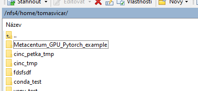

# Metacentum_GPU_Pytorch_example

### How to run this example:

1. upload code and dat to storage (e.g. with WinSCP)
2. 



2. connet to front node using SSH (e.g. with PuTTY)


3. go to strage directory with code

```
cd /storage/brno3-cerit/home/username/Metacentum_GPU_Pytorch_example/code
```

4. run pbs script

```
qsub run_metacentrum.pbs
```


5. check for outputs
